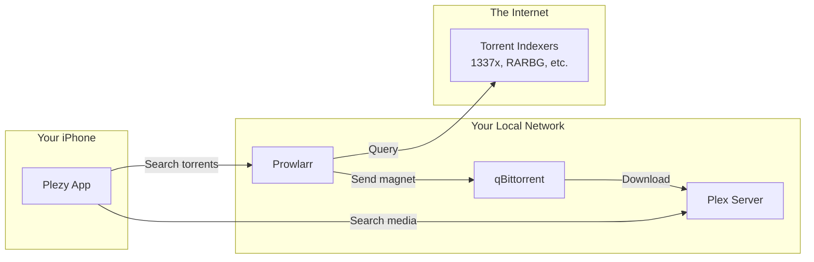

# FOR_ME.md - Prowlarr + Plezy Integration Project

## The "Plain English" Abstract

**What does this project do?**

This project integrates two completely separate apps:
1. **Plezy** – A beautiful third-party Plex client (like Netflix for your own media)
2. **Prowlarr** – A torrent indexer aggregator (like Google for torrent sites)

The goal: When you're watching a show in Plezy and realize you're missing Season 3, you can tap "Search Prowlarr," find the torrent, and send it to your download client (qBittorrent) – all without leaving the app.

**The Analogy:** Think of it like Amazon. When you search for a book and they don't have it, they could show you "Search on eBay" results. That's exactly what we're doing – Plex is Amazon, Prowlarr is eBay.

---

## The Architecture (Visualized)

### How the Apps Talk to Each Other



### Plezy's Existing Architecture

Plezy follows a **clean Provider-Service pattern** (very similar to Android's ViewModel-Repository):

```
lib/
├── models/          # Data classes (DTO equivalent)
├── services/        # Business logic + API calls
├── providers/       # State management (ChangeNotifier)
├── screens/         # UI components
└── widgets/         # Reusable UI pieces
```

**Why this matters:** We'll follow the same pattern. New `ProwlarrClient` service, new `ProwlarrRelease` model, new `ProwlarrSearchScreen`.

### Prowlarr's API

Prowlarr is a .NET backend with a React frontend. We only care about the REST API:

```
/api/v1/search?query=X&categories=Y  →  GET returns list of releases
/api/v1/search                        →  POST grabs a release
/api/v1/indexer                       →  GET lists configured indexers
```

The API uses **X-Api-Key** header for auth (simple and perfect for local network use).

---

## The "War Stories" (Crucial Learning)

### ⚠️ Gotcha #1: Prowlarr's Search vs. Grab Uses Same Endpoint

**The Symptom:** The same `/api/v1/search` endpoint does two completely different things.

**The Root Cause:** GET returns search results, POST takes a release and "grabs" it (sends to download client).

**The Lesson:** Always verify HTTP methods in OpenAPI specs. The endpoint path alone doesn't tell the whole story.

### ⚠️ Gotcha #2: Release Caching

**The Symptom:** When you try to grab a release, Prowlarr might say "Couldn't find release in cache."

**The Root Cause:** Prowlarr caches search results for 30 minutes. If you wait too long between searching and grabbing, the cache expires.

**The Lesson:** 
- Inform users if grab fails with "Try searching again"
- Consider re-searching silently before grab if stale

### ⚠️ Gotcha #3: iOS Local Network Access

**The Symptom:** App would work in simulator but fail on real device.

**The Root Cause:** iOS 14+ requires explicit permission for local network access.

**The Lesson:** Check that `Info.plist` has:
```xml
<key>NSLocalNetworkUsageDescription</key>
<string>Connect to Prowlarr on your local network</string>
```

---

## Tech Decisions & Trade-offs

### Decision 1: Direct API vs. WebView

| Option | Pros | Cons |
|--------|------|------|
| **Direct API** ✅ | Native UI, faster, can pre-fill search | More code to write |
| WebView | Less code, guaranteed parity | Slow, clunky UX, no deep integration |

**We chose**: Direct API – mobile apps deserve native experiences.

### Decision 2: Where to Put the Prowlarr Button

| Option | Pros | Cons |
|--------|------|------|
| Global search | Discoverable | Clutters main search, confuses "is this Plex or Prowlarr?" |
| **Media detail** ✅ | Contextual, knows what you're looking for | Less discoverable |

**We chose**: Media detail screen – it makes sense contextually. You're looking at "Breaking Bad," it's not in your library, you want to get it.

### Decision 3: Store API Key

| Option | Pros | Cons |
|--------|------|------|
| **SharedPreferences** ✅ | Simple, consistent with existing Plex token storage | Not encrypted by default |
| flutter_secure_storage | Encrypted | Overkill for local network API key |

**We chose**: SharedPreferences for MVP. (Technical debt: should migrate to secure storage later)

---

## The "Senior Engineer" Mindset

### Pattern: Service Layering (DRY + Single Responsibility)

```dart
// Good: PlexClient handles ALL Plex API calls
class PlexClient {
  final Dio _dio;  // HTTP client injected
  
  Future<List<PlexMetadata>> search(String query) {
    // One place for Plex API logic
  }
}

// We'll mirror this for Prowlarr
class ProwlarrClient {
  final Dio _dio;
  
  Future<List<ProwlarrRelease>> search(String query) {
    // One place for Prowlarr API logic
  }
}
```

**Why it matters:** If Prowlarr changes their API tomorrow, we fix it in ONE place.

### Pattern: Null Safety + Named Parameters

```dart
Future<bool> grabRelease({
  required int indexerId,
  required String guid,
  int? downloadClientId,  // Optional with default behavior
})
```

**Why it matters:** Clear contract, self-documenting, compiler catches mistakes.

### Pattern: Feature Flags via Settings

```dart
if (settingsService.isProwlarrConfigured()) {
  // Show Prowlarr button
}
```

**Why it matters:** Graceful degradation. Users who don't want Prowlarr never see it.

---

## Current Status

| Phase | Status |
|-------|--------|
| ✅ Clone repos & explore | Complete |
| ✅ Analyze Plezy architecture | Complete |
| ✅ Analyze Prowlarr API | Complete |
| ✅ Write implementation plan | Complete |
| ⏳ Implementation | Not started |
| ⏳ Testing on device | Not started |

---

## Quick Reference: Prowlarr API

```bash
# Test connection
curl "http://YOUR_IP:9696/api/v1/system/status" \
  -H "X-Api-Key: YOUR_KEY"

# Search
curl "http://YOUR_IP:9696/api/v1/search?query=breaking%20bad&categories=5000" \
  -H "X-Api-Key: YOUR_KEY"

# Grab (use indexerId and guid from search)
curl -X POST "http://YOUR_IP:9696/api/v1/search" \
  -H "X-Api-Key: YOUR_KEY" \
  -H "Content-Type: application/json" \
  -d '{"indexerId": 1, "guid": "the-guid-from-search"}'
```

---

*Document generated during Prowlarr-Plezy integration session*
